# hello-world-examen
Examen segunda evaluacion - readme editado

# CREANDO REPOSITORIO
  - Nos dirigimos a GITHUB
  - Pulsamos el mas "+" de ariba a la izquierda y seleccionamos New Repository.
 
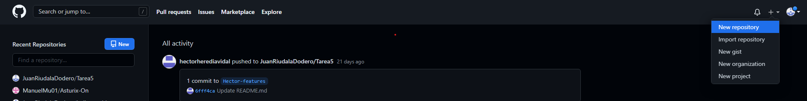

  - Lo llamamos hello-world-examen.
  - Lo ponemos publico.
  - Añadimos un Readme.md
  - Añadimos una dscripcion.
  - Hacemos clik en Create Repository.
 
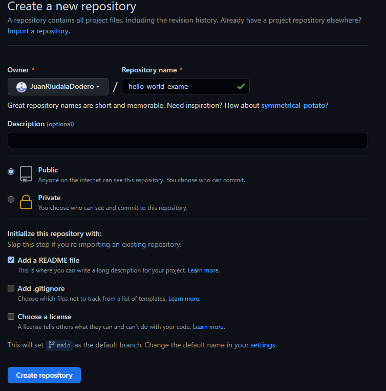

  - Tenemos la pagina creada
 
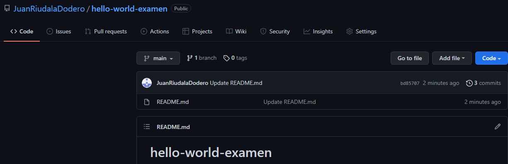

# AÑADIENDO ARCHIVOS

  - Creamos y nos dirigimos una rama llamada features mediante git checkout -b "features".
  - Creamos los archivos story.txt story-edit.txt y story-edit-reviwed.txt mediante el comando touch. 
 
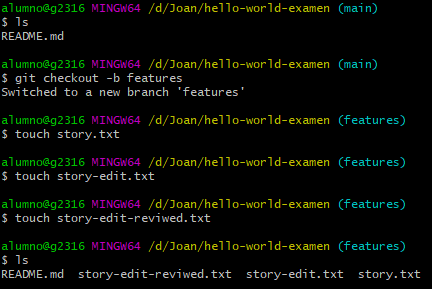

  - Nos logeamos mediante git config - - global user.emal para el mail y user.name para el nombre.
  - mediante un git add y el nombre se los archivos lo subimos al state area.
  - Hacemos un git commit -m "un comentario" y los archivos.
  - Seguido de un git pull origin y la rama que deseas subir.
 
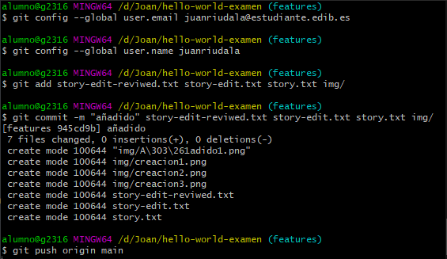

  - En github hacemos un marge del push request
  - Todos los archivos se habran subido al repositorio remoto.
 
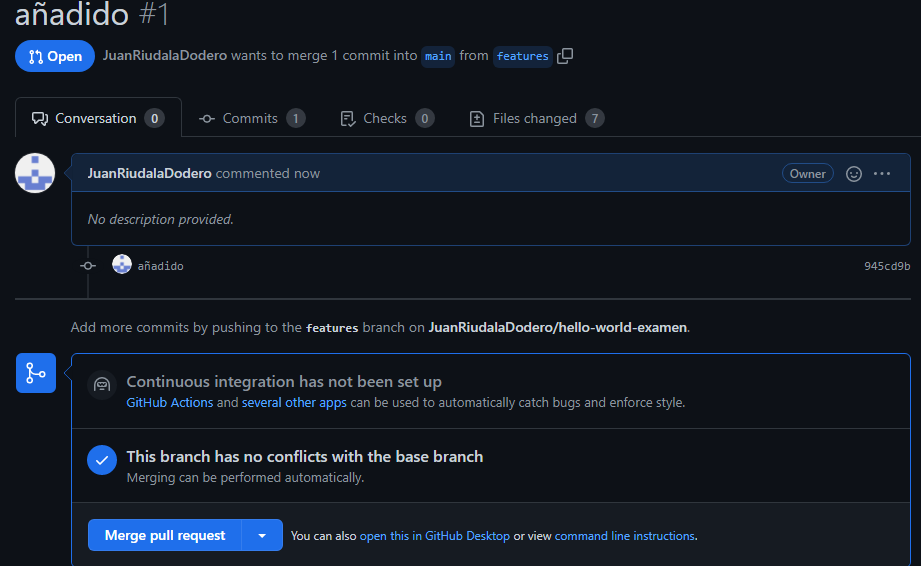

# CREANDO RAMA

  - Nos dirigimos a nuestro repositorio remoto.
  - En el repositorio remoto seleccionamos donde pone main.
  - Alli escribimos reame-edits.
  - Seleccionamos la opcion de crear una rama desde el main.
 
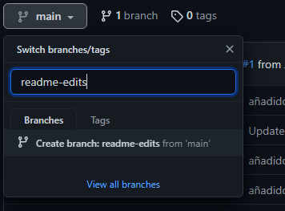

  - Nos dirigimos a la nueva rama creada.
 
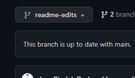

  - Nos dirigimos al Readme.md dentro de la rama readme-edits.
  - Dentro del readme hacemos cambios.
  - Una vez hechos los cambiios hacemos un commit.
 
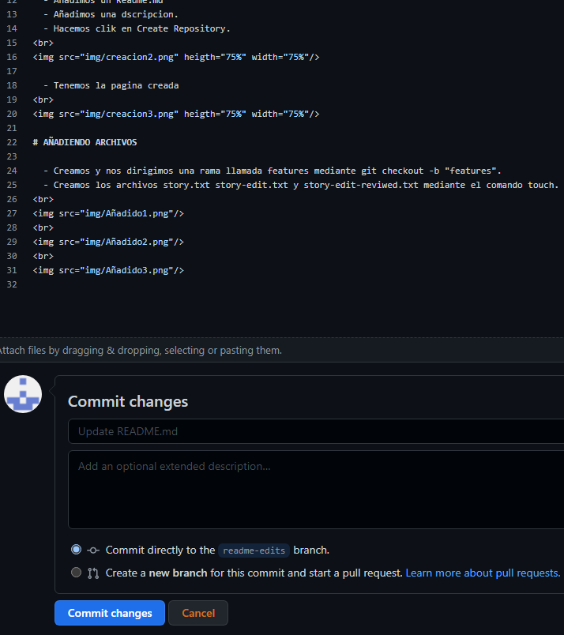

  - Creamos uma pull request desde main de readme-edits.
 
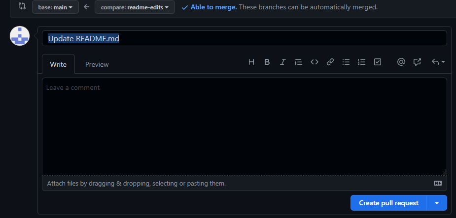

  - Hacemos un marge paraconfirmar los cambios.
 
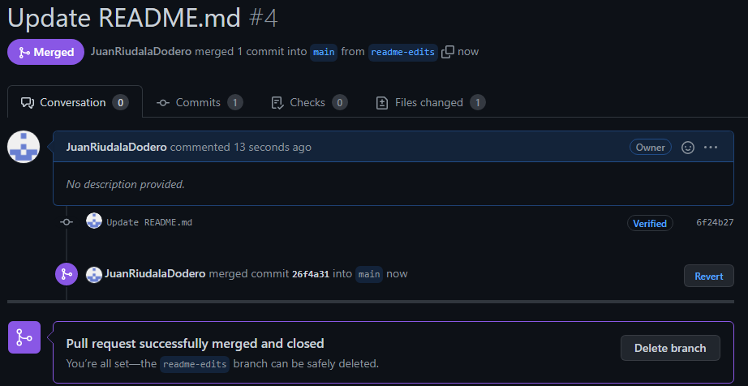

# Pull
  - Nos dirigimos a la pagina New pull request.
  - Seleccionamos New pull request.
  - Indicamos que es desde readme-edit a main.
 
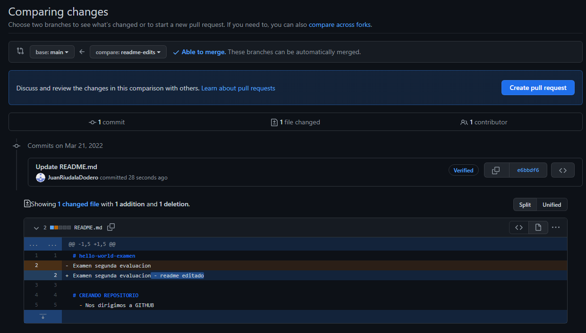

  - Miras si hay conflicto.
  - Si hay conflicto lo areglas manualmente.
  - Haces clik en create a pull request.
 
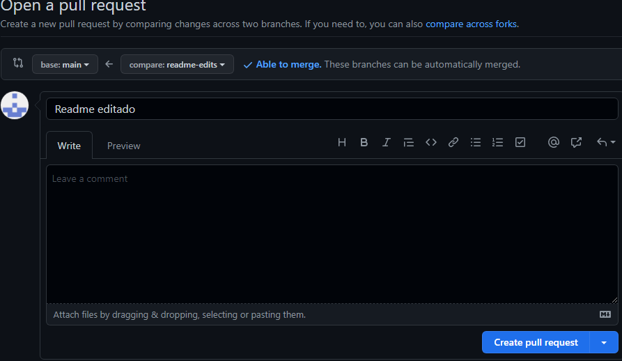
 
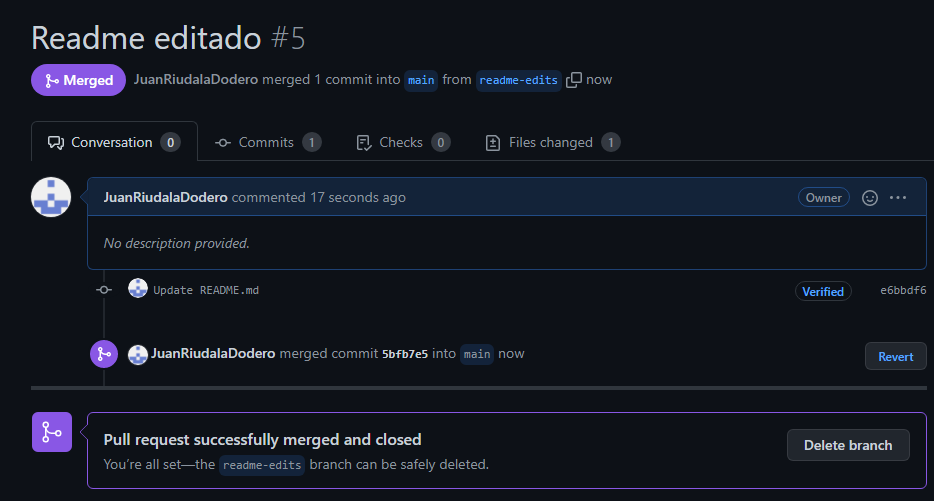

# Delete

 
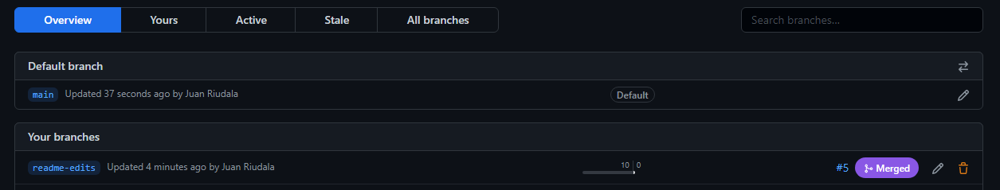
 
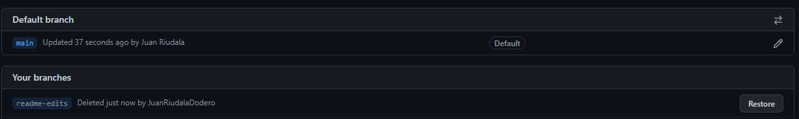

